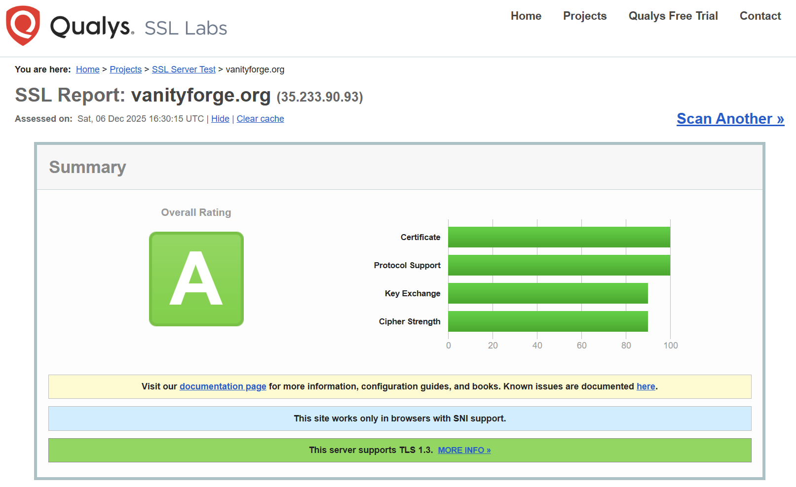

# VanityForge: The Apex of Crypto Identity

Welcome to **VanityForge**. You have arrived at the *absolute pinnacle* of Solana address generation. We provide what others cannot: **Unmatched Speed**, <u>Military-Grade Security</u>, and **24/7 Reliability**.

Stop settling for random addresses. Demand a customized identity that commands *respect* on the blockchain.

---

## 🔒 The "Fort Knox" Security Model

### 🏆 Certified Security: Rated 'A'

We don't just encrypt your data; we secure the transport layer itself. VanityForge has achieved an 'A' Rating from Qualys SSL Labs—the industry gold standard. This score confirms our use of modern Elliptic Curve Cryptography (ECC), strict TLS 1.3 enforcement via Caddy, and perfect forward secrecy. Your connection is as secure as a banking portal.

### For the Non-Technical User
Think of VanityForge like a Swiss Bank Account:
1.  **The Vault:** We provide the unbreakable storage facility.
2.  **The Key:** You set a unique **Encryption PIN** that *only you know*.
3.  **The Guarantee:** Even if we wanted to, we physically cannot open your vault. Without your specific PIN, your private key looks like random noise to us. **If you lose your PIN, the key is gone forever.** That is how secure it is.

Imagine you are staying at a futuristic hotel. You want to store a precious diamond (your Private Key) in the room safe.

The Creation: Our automated robot places the diamond inside the safe for you. The door is wide open.

The Lock: You type in a 4-digit PIN that only you know.

The Magic: The moment you hit "Enter," the safe locks, and the robot suffers "amnesia"—it instantly forgets the PIN you just typed.

The Storage: We (the hotel staff) guard the room. We can see the safe on the wall. We can verify it is locked. But we cannot open it because we don't know the code, and we have no master key.

The Access: When you return and type the PIN, the safe opens.

The Risk: If you forget your PIN, no one—not even the hotel manager—can open that safe. The diamond is locked inside forever.

### For the Technical User
Our security stack is built on **Client-Derived Server-Side Encryption** (`vm_server.py`):
* **Ephemeral RAM Processing:** Your raw private key exists in Volatile Memory (RAM) for exactly **0.05 seconds**—just long enough to be generated and encrypted—before being overwritten and wiped.
* **Fernet Symmetric Encryption:** We utilize the `cryptography` library to implement AES-128 encryption. The encryption key is dynamically derived from your PIN (salted and hashed) at the moment of request.
* **Bcrypt PIN Hashing:** Your PIN is hashed using `bcrypt` before being stored for verification. We never store the raw PIN, preventing rainbow table attacks.
* **Ciphertext Storage:** The database receives **<u>ONLY</u>** the encrypted ciphertext (`U2FsdGVk...`).
* **Strict Isolation:** Decryption logic occurs purely server-side and *only* when triggered by a verified session with the correct PIN.

---

## ☁️ "Fire and Forget" Cloud Persistence

Why burn out your own CPU or battery? VanityForge leverages the raw power of **Dedicated Cloud Infrastructure**.

### The Always-On Engine
Unlike browser-based generators that stop when your screen turns off, our engine runs on a **Google Compute Engine VM** hosted in a Tier-1 Data Center (`europe-west1`).
* **Process Daemonization:** Our workers run as background daemons (`nohup`).
* **Lifecycle Management:** You can start a job, close your browser, turn off your computer, and fly to another country. When you log back in, your job will still be grinding.
* **Resilience:** We handle network interruptions and session disconnects gracefully. Your job state is persistent.

---

## 🚀 Multi-Core Optimization

We don't waste a single cycle. Our engine is a **masterpiece** of efficiency and resource management.

### The "3+1" CPU Affinity Architecture
We have engineered a custom `multiprocessing` architecture to ensure maximum throughput without sacrificing responsiveness.
* **The Muscle (3 Cores):** We dedicate **75% of our compute power** strictly to the grinding algorithm (utilizing `solders` and `base58` bindings for near-native Rust performance).
* **The Brain (1 Core):** We reserve **1 dedicated vCPU** exclusively for the API, Payment Validation, and Database I/O. This guarantees that even under 100% load, the website remains snappy, payments process instantly, and you never face a timeout.
* **CUDA CORE (2506 Core):** The next update will include the usage of cloud-run Nvidia Cuda Cores which will be 100x faster for generating wallets that requires more computational power (such as 6 letter suffixes).

**VanityForge** isn't just a tool; it's a **powerhouse**.

## 💸 Seamless Web3 Integration & Economics

We have bridged the gap between Web2 ease-of-use and Web3 native value.

* **Hybrid Authentication:** Login securely with **Google OAuth** (for ease) or connect directly via **Phantom Wallet** (for anonymity).
* **Solana Native Payments:** Our pricing engine is built on Solana. The frontend integrates `web3.js` to trigger seamless, trustless transfers directly from your Phantom wallet to our Treasury.
* **Dynamic Tiered Pricing:**
    * **Trial Tier:** 2 Free generations for every user (Max 4 chars).
    * **Beta Discount:** Currently offering a **50% Discount** on all premium tiers.
    * **Fairness Algorithm:** Pricing scales exponentially with difficulty ($10^{(L-4)}$), ensuring the cost accurately reflects the computational resources required.
---

## 🗺️ Project Roadmap

### Phase 1: Foundation (COMPLETED ✅)
*   **Establish 4-Core Cloud VM Infrastructure.**
*   **Implement Multi-Core CPU Grinding Algorithm.**
*   **Launch Web3 Login (Phantom Wallet & Google OAuth).**
*   **Deploy Banking-Grade Security (Client-Side Encryption & Zero-Knowledge Storage).**

### Phase 2: Monetization & Polish (IN PROGRESS 🚧)
*   **Implement Solana Payment Gateway (Pay-Per-Forge).**
*   **Launch $VFORGE Token via pump.fun (The official utility token).**
*   **Deploy Email Notification System for long-running jobs.**
*   **Expand capacity to 8-Core 'Fast Track' nodes.**

### Phase 3: The Singularity (FUTURE 🔮)
*   **GPU Acceleration: Migrate to NVIDIA CUDA cores for 100x speed.**
*   **Instant Forge: Sub-minute delivery for 7-character vanity addresses.**
*   **Dao Governance: $VFORGE holders vote on fee structures and new features.**

## 🛠️ The Stack
* **Infrastructure:** Google Compute Engine (Ubuntu 22.04 LTS), Firestore.
* **Backend:** Python 3.11, Flask, Gunicorn, Multiprocessing.
* **Frontend:** HTML5, Tailwind CSS, Firebase SDK, Solana Web3.js.
* **Security:** `cryptography` (Fernet), `bcrypt`, `flask-cors`.

_____________________________________________________________________________________
*Secure your legacy on Solana today with VanityForge.*
